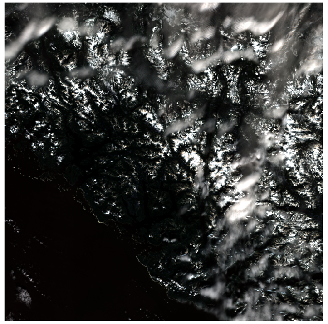
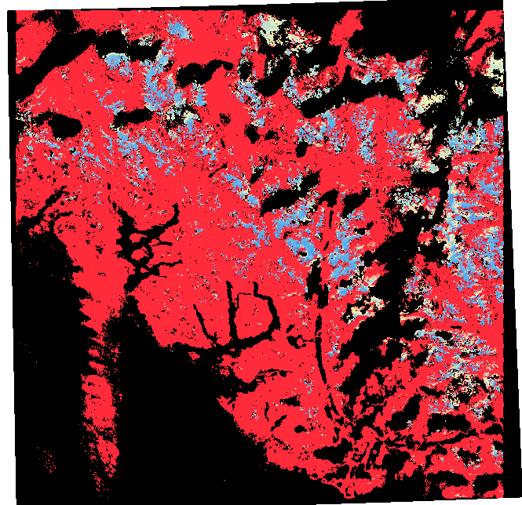

# Credential YAML

This YAML file will be passed to the ``--envpth`` argument to be able to download MODIS/VIIRS/Sentinel-2 data. This file needs to be located inside the mounted volume store in order for the internal processes to access the credentials. 

```bash
--envpth /data/<credential>.yml
```

<details>
<summary>YAML</summary>

```yaml
# register at https://urs.earthdata.nasa.gov/home
EARTHDATA_USER: username_without_quotes
EARTHDATA_PASS: password_without_quotes

# register at https://scihub.copernicus.eu/dhus/#/self-registration 
SENTINELSAT_USER: username_without_quotes
SENTINELSAT_PASS: password_without_quotes
```

</details>

# MODIS/VIIRS Pipeline

## Docker 

### Building Docker Image

To build the image from this directory:

```bash
docker build -t <tagname> .
```

### Running Docker Image

To run the Docker image use the following schema:

```bash
docker run --rm -v <local store>:/data <tagname> <extra_commands>
```

## Input Formats

| ARG | VALUES | TYPE |
|---|---|---|
| envpth | Linux path | string |
| date | YYYY.MM.DD | string |
| sat  | modis / viirs / sentinel | string |
| typ | watersheds / basins | string |
| days | 1 / 5 / 8 | int |

## Docker Options

| OPTION | CAUSE | 
|---|---|
| --rm | Removes container once it finishes running |
| -v | Mount volume to Docker container |

## Help

To list out commands available:

The default CMD is "--help" to list out the available commands. 

```bash
docker run --rm -v <mount_point>:/data <tag_name>
```

## FAQ

Why is there an authentication error when downloading MODIS or VIIRS data?

<details>
<summary>Answer</summary>

A HTML 503 Authentication Error is an expected behaviour from 
the NASA servers while downloading large amounts of data. Be patient as the download
will retry and continue once the service is made available again. 

</details>

## Daily-Pipeline

```bash
docker run --rm -v <mount_point>:/data <tag_name> daily-pipeline --envpth /data/<creds.yml> --date <target_date: YYYY.MM.DD>
```

``daily-pipeline`` kicks off the entire process chain that will include performing the following per satellite (MODIS/VIIRS):

- Build up directory structure and supporting files
- Download raw granule files
- Process raw granules to GTiff formats
- Calculate snow coverage per watersheds/basin
- Build KML of watersheds/basins
- Clean up intermediate files

## Build Directory Structure

Builds necessary supporting files and directories in order for the process pipeline to properly manage file I/O. 

```bash
docker run --rm -v <mount_point>:/data <tag_name> build
```

High Level Directory Structure:
- /data
    - /analysis
    - /basins
    - /intermediate_kml
    - /intermediate_tif
    - /kml
    - /modis-terra
    - /output_tif
    - /plot
    - /watersheds

## Download

MODIS requires 5 or 8 days in order to build a composite of valid data. Option to download one day is possible. 
VIIRS will download a single day as it is a cloud-gap-filled product. 

```bash
docker run --rm -v <mount_point>:/data <tag_name> download --envpth /data/<creds.yml> --sat <modis/viirs> --date <YYYY.MM.DD> --days <1/5/8>
```

Output:
- Raw granules: ``modis-terra/<product>/<date>/.``
    - MODIS: MOD10A1.006
    - VIIRS: VNP10A1F.001

## Process

MODIS requires 5 or 8 days in order to build a composite of valid data. Default value is 5 days. 

```bash
docker run --rm -v <mount_point>:/data <tag_name> process --sat <modis/viirs> --date <YYYY.MM.DD> --days <1/5/8>
```

Output:
- Clipped watershed/basin GTiff: ``<watershed/basin>/<name>/<satellite>/<date>/.``
    - EPSG:4326 -> needed for KML
    - EPSG:3153 -> BC Albers projection GTiff


## Caclulate Snow Coverage

Analyze each watershed and basin to calculate the snow coverage based on the NDSI value. 

```bash
docker run --rm -v <mount_point>:/data <tag_name> run-analysis --typ <watersheds/basins> -sat <modis/viirs> --date <YYYY.MM.DD>
```

Output:
- SQLITE3 database: ``analysis/analysis.db``

## Database To CSV

Convert the SQLITE3 database into a CSV

```bash
docker run --rm -v <mount_point>:/data <tag_name> dbtocsv
```

Output: 
- CSV: ``analysis/analysis.csv``

## Build KMLs and Colour Ramped GTiffs

Build the colour-ramp GTiff and KML versions of the watersheds/basins.

```bash
docker run --rm -v <mount_point>:/data <tag_name> build-kml --date <YYYY.MM.DD> --typ <watersheds/basins> --sat <modis/viirs>
```

Output : 
- colourized GTiffs: ``<watersheds/basins>/<name>/<satellite>/<date>/.``
- KML : ``kml/<date>/``

## Compose KMLs

Compose built KML files into a heirarchal KML

```bash
docker run --rm -v <mount_point>:/data <tag_name> compose-kmls --date <YYYY.MM.DD> --sat <modis/viirs>
```

## Zip KMLs

ZIP KMLs into a ZIP file

```bash
docker run --rm -v <mount_point>:/data <tag_name> zip-kmls
```

KNOWN ISSUE: ZIP file is larger than original KMLs -- deprecated

## Plot

Plot all watersheds and basins into PNG plots with mapped colour bar.

```bash
docker run --rm -v <mount_point>:/data <tag_name> plot --date <YYYY.MM.DD> --sat <modis/viirs>
```

## Clean

Manually clean up files and directories.

| TARGET | CAUSE |
|---|---|
| all | Non-vital directories in ``/data`` |
| intermediate | Intermediate files in ``intermediate_\[tif/kml\]`` |
| output | Output files in ``output_tif`` |
| downloads | Raw granules in ``modis-terra/`` |
| watersheds | All files/dirs in ``watersheds/`` | 
| basins | All files/dirs in ``basins/`` |

```bash
docker run --rm -v <mount_point>:/data <tag_name> clean --target <target>
```

# Sentinel-2 Pipeline

## Docker

### Building Docker Image

To build the image from this directory:

```bash
docker build -t <tagname> .
```

### Running Docker Image

To run the Docker image use the following schema:

```bash
docker run --rm -it -v <local store>:/data <tagname> <extra_commands>
```

It is necessary to run the docker container in interactive mode (by including the ``-it`` option when calling ``docker run``) as the Sentinel-2 process requires user interaction.

## Process-Sentinel

Call the Sentinel-2 pipeline

```bash
docker run --rm -it -v <mount point>:/data <tag name> process-sentinel --creds /data/<creds.yml> --lat <latitude> --lng <longtitude> --date <YYYY.MM.DD>
```

The pipeline will return a date ordered list of 10 

| OPTIONAL ARGS | VALUES | DEFAULT |
|---|---|---|
| --rgb | true / false | false |
| --max-allowable-cloud | int | 50 |
| --force-download | true / false | false |
| --day-tolerance | int | 50 |

Outputs are logged to a log file in ``/data/log/``.

## Argument Details:

- Latitude and Longtitude are WSG84 float numbers (-180 <= lat/lng => +180). 
- ``--rgb true`` : Creates a RGB output GTiff of the selected tile
- ``--max-allowable-cloud <int>`` : Max percentage of cloud cover that is allowable in the query. Default is 50%.
- ``--force-download true`` : Deletes existing downloads in target directory
- ``--day-tolerance <int>`` : Number of days to look back from target date with given cloud expections. Default is 50 days.

## Example 0

Using default arguments to demonstrate expected output.

```bash
docker run --rm -it -v <mount point>:/data <tag name> process-sentinel --creds /data/sat.yml --lat 49.12 --lng -126.5  --date 2021.03.18

0 : DATE: 2021-03-17 || CLOUD%:  45.588648
1 : DATE: 2021-03-14 || CLOUD%:  17.49127
2 : DATE: 2021-03-07 || CLOUD%:  39.499657
3 : DATE: 2021-02-05 || CLOUD%:  16.117952
4 : DATE: 2021-01-31 || CLOUD%:  23.281466
5 : DATE: 2021-01-28 || CLOUD%:  2.606739
Pick which product to download and process [0-5/n]:
```

## Example 1

Calling with high cloud tolerance and demonstrate upper limit of selection and typical output.

```bash
docker run --rm -it -v <mount point>:/data <tag name> process-sentinel --creds /data/sat.yml --lat 49.73 --lng -126.5  --date 2021.03.18 --rgb true --max-allowable-cloud 90

0 : DATE: 2021-03-17 || CLOUD%:  32.746968
1 : DATE: 2021-03-14 || CLOUD%:  87.006531
2 : DATE: 2021-03-09 || CLOUD%:  45.446411
3 : DATE: 2021-03-07 || CLOUD%:  74.669036
4 : DATE: 2021-02-25 || CLOUD%:  84.000973
5 : DATE: 2021-02-22 || CLOUD%:  79.523277
6 : DATE: 2021-02-17 || CLOUD%:  56.401063
7 : DATE: 2021-02-15 || CLOUD%:  74.093911
8 : DATE: 2021-02-10 || CLOUD%:  32.880395
9 : DATE: 2021-02-07 || CLOUD%:  75.293885
Pick which product to download and process [0-9/n]: 0

Downloading: 100%|█████████████████████████████████████████████████████████████████████████████████████████████████████████████| 1.09G/1.09G [03:30<00:00, 5.19MB/s]MD5 checksumming: 100%|█████████████████████████████████████████████████████████████████████████████████████████████████████████| 1.09G/1.09G [00:04<00:00, 231MB/s]
0
```

Notice the clouds and water are masked out form the analysis.





## Example 2

Calling with low cloud tolerance to demonstrate limited selection.

```bash
docker run --rm -it -v <mount point>:/data <tag name> process-sentinel --creds /data/sat.yml --lat 49.12 --lng -126.5  --date 2021.03.18 --max-allowable-cloud 20 --max-allowable-cloud 20

0 : DATE: 2021-03-14 || CLOUD%:  17.49127
1 : DATE: 2021-02-05 || CLOUD%:  16.117952
2 : DATE: 2021-01-28 || CLOUD%:  2.606739
Pick which product to download and process [0-2/n]:
```